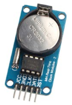

# Light Switch Robot

## Table of contents
* [Overview](#overview)
* [Examples](#examples)
* [Technologies](#technologies)
* [Limitations](#limitations)

## Overview
This is an Arduino project to turn on my room light in the morning to avoid oversleeping.

## Examples

> Horrible looking but functional prototype :smiley:

## Technologies
- **Arduino Uno**
- **LED Display Module**
  - Adafruit_SSD1306 Library
- **Servo Motor**
  - Servo Library
- **General Electronics Skills**
  - Hooking up wires to connect the components

## Limitations
To truly get the time of the day, an RTC module *(as shown below)* should be used.  
  
However, the time of the day does not necessarily need to be known if the clock counts down in 24 hour cycles.  
This leads to some problems:  
- **The 24 hour cycle must start at a very specific time**
  - If the servo turns on the light every 24 hours on a countdown, then the Arduino must be plugged in and started exactly at the time of the desired light switch
    - This problem has been lessened by adding an offset timer before the desired time of the light switching. This way the Arduino must be started at a specific time, however, it does not need to be started exactly at the time of the desired light switch cycle.
- **We better hope the delay one second function is accurate**
  - Of course the delay is accurate. It should be recognized, however, that it takes time for the Arduino to update the display. Therefore, we can't just delay for 1000 milliseconds, but instead, we must calculate how long it takes to update the display.
    - The code accommodates the display update time, however it may be true that different display messages take different amounts of time to update the screen.
    - The future will tell if my calculations were correct :satisfied:.

## License
Licensed under the [MIT License](LICENSE).
